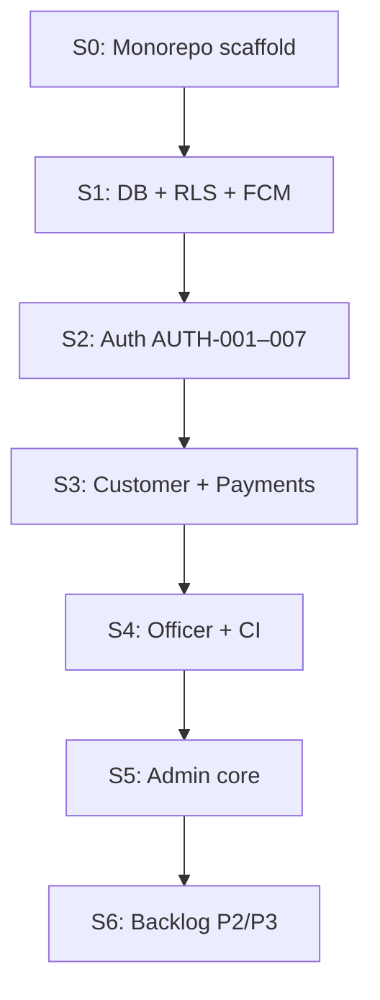

# Prime Fibernet — Build From Scratch Guide

> **One document to understand, clone, and run the entire platform.**  
> Version 2.0 · June 2026 · Unified React Native app (Customer + Officer + Admin)

---

## How to use this document

| If you want… | Go to |
|--------------|-------|
| Clone and run locally in 15 minutes | [§3 Quick start](#3-quick-start-clone--run) |
| Full feature list by role | [§5 Feature catalog](#5-feature-catalog) |
| Where code lives | [§4 Repository map](#4-repository-map) |
| Database + backend setup | [§6 Supabase backend](#6-supabase-backend) |
| Build order from zero to MVP | [§8 Implementation order](#8-implementation-order-sprint-plan) |
| Deep product requirements | [PRD.md](./PRD.md) |
| Architecture diagrams | [TECHNICAL_ARCHITECTURE.md](./TECHNICAL_ARCHITECTURE.md) |
| Security / RBAC | [SECURITY_AND_ACCESS.md](./SECURITY_AND_ACCESS.md) |
| UI / screen specs | [FRONTEND_SPEC.md](./FRONTEND_SPEC.md) |
| 42 ticket breakdown | [FEATURE_TICKETS.md](./FEATURE_TICKETS.md) |

**There is no other single file** that replaces this guide. Previously, knowledge was split across `README.md`, `docs/PRD.md`, `docs/TECHNICAL_ARCHITECTURE.md`, and `.cursor/rules/*`. This document consolidates the **operational** view; the linked docs remain the authoritative deep dives.

---

## 1. What you are building

**Prime Fibernet** is an enterprise ISP management platform:

- **One codebase** → iOS, Android, and web (Admin-optimized)
- **Three roles** resolved at login from `profiles.role`:
  - **Customer** — subscribe, pay bills, raise service requests, AI support
  - **Officer** — field jobs, GPS attendance, collections, inventory, payslips
  - **Admin** — users, officers, plans, payments, invoices, HR, support, analytics

**Backend:** Supabase (Postgres + Auth + Realtime + Storage + Edge Functions)

**Frontend:** Expo SDK 54 · React Native 0.73+ · TypeScript 5 · Redux Toolkit + RTK Query · React Navigation 6 · React Hook Form + Zod

---

## 2. Prerequisites & external services

### 2.1 Local tools

| Tool | Version | Purpose |
|------|---------|---------|
| Node.js | 20+ | Runtime |
| pnpm | 10+ | Monorepo package manager |
| Supabase CLI | latest | Migrations & edge function deploy |
| Expo Go | SDK 54+ | Mobile dev (or EAS dev client) |
| Git | any | Clone repo |

### 2.2 Cloud accounts (production / full features)

| Service | Used for | Env var(s) |
|---------|----------|------------|
| **Supabase** | DB, Auth, Storage, Realtime, Edge Functions | `EXPO_PUBLIC_SUPABASE_URL`, `EXPO_PUBLIC_SUPABASE_ANON_KEY`, `SUPABASE_SERVICE_ROLE_KEY` |
| **Razorpay** | Payment gateway (primary) | `EXPO_PUBLIC_RAZORPAY_KEY_ID`, gateway credentials in DB |
| **Easebuzz** | Alternate payment gateway | Stored encrypted in `payment_gateways` table |
| **Resend** | Transactional email (verification, invoices, notifications) | Supabase Edge Function secrets |
| **Google Gemini** | AI chatbot (`gemini-rag-chatbot`) | Edge Function secret |
| **Firebase Cloud Messaging** | Push notifications | FCM config in Expo + `user_fcm_tokens` table |
| **Sentry** | Error monitoring (optional dev) | `EXPO_PUBLIC_SENTRY_DSN` |
| **Google Maps** | Officer map, geofencing | Platform API keys in Expo config |

Copy env template:

```bash
cp .env.example apps/unified-app/.env
```

Required minimum for local dev:

```env
EXPO_PUBLIC_SUPABASE_URL=https://YOUR_PROJECT.supabase.co
EXPO_PUBLIC_SUPABASE_ANON_KEY=your_anon_key
EXPO_PUBLIC_APP_ENV=development
```

---

## 3. Quick start (clone → run)

### Step 1 — Clone & install

```bash
git clone <your-repo-url> Prime_fibernet
cd Prime_fibernet
pnpm install
```

### Step 2 — Environment

```bash
cp .env.example apps/unified-app/.env
# Edit apps/unified-app/.env with your Supabase project URL + anon key
```

### Step 3 — Supabase project

**Option A — Use existing team project:** skip creation; use shared credentials.

**Option B — New project from scratch:**

```bash
# Login & link (one-time)
supabase login
supabase link --project-ref YOUR_PROJECT_REF

# Apply all migrations (40+ files in supabase/migrations/)
supabase db push

# Deploy edge functions (see §6.3 for full list)
supabase functions deploy --project-ref YOUR_PROJECT_REF
```

Seed dev users (optional):

```bash
pnpm seed:dev-users
```

### Step 4 — Run the app

```bash
# Always from repo root — launches apps/unified-app
pnpm dev
```

Scan QR with **Expo Go SDK 54+**. Do **not** run `npx expo start` at monorepo root (wrong project).

### Step 5 — Verify

```bash
pnpm typecheck   # TypeScript across packages
pnpm lint        # ESLint via turbo
```

**Login flow:** App → Auth screen → sign in → `AppNavigator` routes by `profiles.role` to Customer tabs, Officer drawer, or Admin drawer.

---

## 4. Repository map

```
Prime_fibernet/
├── apps/unified-app/          ← THE APP (all roles)
│   ├── src/
│   │   ├── screens/
│   │   │   ├── admin/         Admin modules (finance, HR, support…)
│   │   │   ├── customer/      Customer tabs + stacks
│   │   │   ├── officer/       Officer drawer + field ops
│   │   │   └── common/        Shared screens (auth, PDF viewer)
│   │   ├── components/
│   │   │   ├── admin/         FormField, SectionCard, KPI cards…
│   │   │   ├── common/        ScreenWrapper, modals, keyboard helpers
│   │   │   ├── customer/      Customer-specific UI
│   │   │   └── officer/       Officer-specific UI
│   │   ├── navigation/        Role navigators (AppNavigator, AdminNavigator…)
│   │   ├── store/
│   │   │   ├── slices/        Redux UI/auth slices
│   │   │   └── api/           RTK Query baseApi + endpoints
│   │   ├── services/          Non-RTK helpers (notifications, PDF, etc.)
│   │   ├── hooks/             useAuth, useCreateNotification, realtime…
│   │   ├── types/             navigation.ts, database.ts, domain types
│   │   ├── theme/             colors, spacing, admin/customer tokens
│   │   └── utils/             Formatters, validators
│   └── app.json               Expo config
├── packages/
│   ├── ui/                    @prime/ui — Screen, Button, typography
│   ├── types/                 Shared Zod schemas
│   ├── api-client/            Supabase client factory
│   └── config/                ESLint + TSConfig presets
├── supabase/
│   ├── migrations/            40+ SQL migrations (schema + RLS)
│   ├── functions/             30+ Edge Functions
│   └── seed/                  Seed data (if present)
├── docs/                      Product & architecture docs
│   ├── BUILD_FROM_SCRATCH.md  ← THIS FILE
│   ├── PRD.md
│   ├── TECHNICAL_ARCHITECTURE.md
│   └── FEATURE_TICKETS.md
├── .cursor/rules/             AI/coding standards (theme, Supabase deploy, etc.)
└── archive/                   Deprecated legacy two-app scaffold
```

### Key architectural rules

1. **Role gating** — Screens unreachable by wrong role, not just hidden (`useAuth().role` + navigators).
2. **RTK Query only** — No raw `fetch` in screens; all server state via `store/api`.
3. **Forms** — React Hook Form + Zod everywhere.
4. **Schema changes** — Only via `supabase/migrations/*.sql`; deploy via Supabase MCP or CLI.
5. **UI** — Theme tokens from `@/theme/*` and `@prime/ui`; no hardcoded colors.

See `.cursor/rules/prime-fibernet-context.mdc` and `.cursor/rules/unified-app-standards.mdc`.

---

## 5. Feature catalog

Features below reflect **what is implemented in the codebase** (navigation + screens + backend). For acceptance criteria per ticket, see [FEATURE_TICKETS.md](./FEATURE_TICKETS.md).

### 5.1 Authentication (all roles)

| Feature | Code entry | Backend |
|---------|------------|---------|
| Email/password login | `screens/common/auth/` | Supabase Auth |
| Sign-up + verification | Auth screens | `supabase.auth.signUp` + Resend |
| Admin TOTP 2FA | Auth flow | `functions/verify-admin-totp` |
| Forgot password | Auth screens | Supabase Auth reset |
| Biometric login (dev) | Auth hooks | `expo-local-authentication` + SecureStore |
| Role-based routing | `navigation/AppNavigator.tsx` | `profiles.role` |
| JWT in SecureStore | `store/slices/authSlice` | `expo-secure-store` |
| Dev quick sign-in | Auth screen (dev only) | Seed users script |

### 5.2 Customer features

**Navigation:** `CustomerNavigator.tsx` — tabs: Home, Plans, Pay, Support, Profile

| Module | Screens | Notes |
|--------|---------|-------|
| Dashboard | `customer/dashboard/DashboardScreen` | Plan card, quick actions, requests |
| Plans | `customer/plans/PlansScreen`, `PlanDetails`, `PlanChangeRequest` | Catalog, subscribe flow |
| Payments | `CustomerBillScreen`, `Checkout`, `GatewayWebView`, `PaymentSuccess`, `PaymentHistory`, `Receipt`, `MyBills` | Razorpay/Easebuzz webview |
| Service requests | `CustomerTicketList`, `CreateCustomerTicket`, `CustomerTicketDetail` | Realtime status |
| Support | `CustomerSupportHub`, `CustomerLiveChat`, FAQs, `ChatbotScreen` (Prima AI) | Gemini edge function |
| Profile | `ProfileScreen` | Edit profile, change password, delete account |
| Notifications | `CustomerNotificationsScreen` | Push + in-app |
| Legal | About, Terms, Privacy, Refund | Static / CMS |

### 5.3 Officer features

**Navigation:** `OfficerNavigator.tsx` — LocationGate → drawer

| Module | Screens | Notes |
|--------|---------|-------|
| Location gate | `LocationGateScreen` | GPS required before access |
| Dashboard | `OfficerDashboardScreen` | Shift, today's jobs |
| Requests | `OfficerRequestsStackNav` | Accept → resolve workflow |
| Map | `OfficerMapScreen` | Live location, job pins |
| Attendance | `OfficerAttendanceDashboard`, `AttendanceHistoryScreen` | Geofenced clock-in/out |
| Collections | `OfficerCollectionsStackNav`, `CollectPaymentScreen` | Assigned customers, cash collection |
| Inventory | `OfficerInventoryScreen` | Assigned equipment |
| Payslips | `OfficerPayslipStackNav` | View/download PDF |
| Leave | `OfficerLeaveStackNav` | Leave requests |
| Notifications | `OfficerPortalNotificationsScreen` | Portal alerts |
| Support chat | `OfficerSupportChatScreen` | Internal support |
| Profile | `OfficerProfileStackNav` | Officer profile |
| Invoices | `InvoiceScreen` | Generate/view invoice on collection |
| Employment contract | Contract signature prompt modal | E-sign flow |

### 5.4 Admin features

**Navigation:** `AdminNavigator.tsx` — drawer with 16 modules

| Drawer module | Key screens | Backend areas |
|---------------|-------------|---------------|
| **Dashboard** | KPIs, charts, activity feed | Analytics API, Realtime |
| **Users** | List, detail, add, edit, block | `profiles`, `subscriptions` |
| **Officers** | List, add, edit, documents, contracts | `officers`, Storage, employment contracts |
| **Attendance** | Live map, geofences, shifts, leave, reports | PostGIS, geofence RPCs |
| **Payroll** | Payroll run, payslips, review, settings, PDF | `functions/generate-payslip` |
| **Role management** | RBAC permissions | `admin_permissions` |
| **Requests** | Service request oversight, assign officer | `service_requests` |
| **Ticket portal** | Internal tickets, link to requests | `tickets` |
| **Plans** | CRUD, duplicate, deactivate | `plans` |
| **Notifications** | Broadcast, schedule, automation rules | `functions/send-broadcast-notification`, cron |
| **Payments** | List, review, gateways, analytics, refunds, collection assignments | Razorpay webhooks, `payments` |
| **Invoices** | List, create, GST manual, settings, bulk send, PDF | `functions/invoice-generator`, `send-invoice` |
| **Inventory** | Categories, stock, bulk ops, history | `inventory_*` tables |
| **Reports** | Revenue, exports | Analytics API |
| **Customer support** | Tickets, live chat, FAQs, SLA, canned responses, Customer 360 | Support tables + AI chat |
| **Settings** | General, security, integrations, backup, audit logs | `settings`, audit |
| **Map** | Officer trail replay, live tracking | PostGIS, tracking |

---

## 6. Supabase backend

### 6.1 Migration timeline (apply in order)

All files in `supabase/migrations/` — run via `supabase db push`:

| Migration prefix | Domain |
|------------------|--------|
| `20260607*` | Initial schema, RLS, auth sync |
| `20260608–09*` | Admin RLS fixes, profile fields |
| `20260611*` | Officer management, geofence attendance |
| `20260614*` | Tickets portal, plans, notifications, inventory |
| `20260615–16*` | Settings panel, customer support |
| `20260617–19*` | Officer tracking (PostGIS), payment collection |
| `20260620–26*` | Collection portal v2, open pool, fixes |
| `20260627*` | Customer portal extend |
| `20260628–30*` | Employment contracts, signatures, documents |
| `20260631*` | Payslip module |
| `20260632*` | Invoice module extend |
| `20260633*` | Notification delivery fix, automation rules |

Inventory: [SUPABASE_MIGRATION_INVENTORY.md](./SUPABASE_MIGRATION_INVENTORY.md)

### 6.2 Core tables (high level)

```
profiles          — users (role: customer | officer | admin)
officers          — field staff metadata
plans             — broadband plans
subscriptions     — customer ↔ plan
payments          — transactions
service_requests  — installation/repair jobs
tickets           — support tickets
notifications     — broadcast + scheduled
payment_gateways  — encrypted gateway credentials
inventory_*       — asset tracking
attendance_*      — shifts, geofences, check-ins
employment_contracts — HR contracts + signatures
invoices          — GST invoices + line items
payslips          — officer payroll
audit_logs        — admin actions
user_fcm_tokens   — push notification tokens
```

Generated types: `apps/unified-app/src/types/database.ts` (regenerate after schema changes).

### 6.3 Edge Functions

Deploy all under `supabase/functions/`:

| Function | Purpose |
|----------|---------|
| `verify-admin-totp` | Admin 2FA |
| `admin-create-customer` / `admin-create-officer` | Provision users |
| `provision-officer-auth` | Officer auth setup |
| `create-payment-order` | Initiate Razorpay/Easebuzz order |
| `verify-payment` | Confirm payment post-gateway |
| `payment-webhook` / `razorpay-webhook` | Gateway callbacks |
| `process-payment` / `process-refund` | Payment lifecycle |
| `save-gateway-credentials` | Encrypt & store gateway keys |
| `generate-payment-receipt` | PDF receipt |
| `invoice-generator` / `send-invoice` / `bulk-send-invoices` | Invoice pipeline |
| `send-broadcast-notification` | Admin push broadcasts |
| `process-scheduled-notifications` | Cron: scheduled sends |
| `process-recurring-notifications` | Cron: recurring broadcasts |
| `subscription-expiry-cron` | Expiry reminders |
| `check-sla-breaches` | Support SLA alerts |
| `gemini-rag-chatbot` / `ai-support-chat` / `chatbot-service` | AI support |
| `create-support-ticket` / `assign-chat-agent` | Support routing |
| `generate-payslip` | Payroll PDF |
| `compute-daily-activity` | Officer activity cron |
| `export-payments` / `admin-backup-export` | Data export |

**Deploy rule:** Always apply migrations and functions via Supabase MCP or CLI — see `.cursor/rules/supabase-deploy.mdc`.

### 6.4 RLS & security

- Every table has Row Level Security policies.
- Customers see only their rows; officers see assigned scope; admins use `is_admin()` helper.
- Full matrix: [SECURITY_AND_ACCESS.md](./SECURITY_AND_ACCESS.md)

---

## 7. Frontend patterns (how features are wired)

```
Screen
  └── useGetXQuery / useMutation (RTK Query in store/api/endpoints.ts)
        └── baseApi → Supabase client OR Edge Function invoke
  └── React Hook Form + Zod schema
  └── Loading / Error / Empty states (required)
  └── RoleGuard (admin screens with permissions)
```

| Concern | Location |
|---------|----------|
| API endpoints | `apps/unified-app/src/store/api/endpoints.ts` |
| Auth state | `store/slices/authSlice.ts` |
| Navigation types | `types/navigation.ts` |
| Admin stacks | `navigation/adminStackNavigators.tsx` |
| Theme | `theme/colors.ts`, `theme/admin.ts`, `@prime/ui` |
| Shared modals | `components/common/FullScreenModalShell`, `ModalSheetHeader` |
| Keyboard UX | `components/common/DismissKeyboardScrollView` — see `safe-area-keyboard.mdc` |

---

## 8. Implementation order (sprint plan)

Official 42 tickets · 229 story points · [FEATURE_TICKETS.md](./FEATURE_TICKETS.md)



| Sprint | Tickets | Build this |
|--------|---------|------------|
| **S0** | — | `apps/unified-app`, navigators, theme, `pnpm dev` |
| **S1** | INFRA-004/005/006 | Migrations, RLS, FCM token storage |
| **S2** | AUTH-001→007 | Login, signup, TOTP, refresh, role guard |
| **S3** | CUST-001/002, PYMT-001→003 | Customer dashboard, plans, payment gateway |
| **S4** | OFF-001→004, INFRA-001/002 | Officer requests, map, attendance, EAS/Sentry |
| **S5** | ADM-001→005 | Admin users, officers, plans, requests, dashboard |
| **S6** | Remaining | Chatbot, analytics, exports, automation, invoices, HR |

**First vertical slice after S0:**

1. Login screen → Supabase sign-in  
2. Read `profiles.role` → navigate to role home  
3. One RTK Query hook on Customer dashboard (proves API layer)

Current status (see root [README.md](../README.md)): S0–S6 marked **Done**; ongoing work adds modules (invoices, payroll, notification automation, etc.).

---

## 9. Build a specific feature (recipe)

Example: **Admin broadcast notification**

1. **Schema** — migration for any new columns (`notification_automation_rules`, etc.)
2. **RLS** — policies for admin write, service role for edge functions
3. **Edge function** — `send-broadcast-notification` (server-side FCM)
4. **RTK Query** — mutation in `endpoints.ts` or `services/broadcastNotificationService.ts`
5. **Screen** — `CreateNotificationScreen` + `AudiencePickerSheet`
6. **Navigation** — register in `adminStackNavigators.tsx`
7. **Types** — `types/notifications.ts`, `types/navigation.ts`
8. **Verify** — loading/error/empty states, role guard, `pnpm typecheck`

---

## 10. Quality checklist (definition of done)

Every feature must have:

- [ ] Loading, error, and empty states
- [ ] RLS reviewed if new table or access pattern
- [ ] Role-gated correctly (not just hidden UI)
- [ ] No `console.log` — use project logger if needed
- [ ] Theme tokens only (no hardcoded hex)
- [ ] Forms: React Hook Form + Zod
- [ ] `pnpm typecheck` passes

---

## 11. Common commands

```bash
pnpm install              # Install all workspace deps
pnpm dev                  # Start Expo (unified-app)
pnpm web                  # Web build/dev
pnpm typecheck            # TypeScript check
pnpm lint                 # ESLint
pnpm seed:dev-users       # Seed test accounts
supabase db push          # Apply migrations
supabase functions deploy <name>  # Deploy one function
```

---

## 12. Troubleshooting

| Problem | Fix |
|---------|-----|
| Expo starts wrong app | Use `pnpm dev` from repo root, not `npx expo start` at root |
| Auth works but empty data | Check RLS policies; verify user role in `profiles` |
| Payments fail | Gateway credentials in Admin → Settings → Payment gateways |
| Push notifications don't send | FCM token stored? Edge function deployed? Check `user_fcm_tokens` RLS |
| Modal header under status bar | Use `FullScreenModalShell` / `ModalSheetHeader` — see `safe-area-keyboard.mdc` |
| Type errors after migration | Regenerate `database.ts` from Supabase types |

---

## 13. Document index (deep dives)

| Document | Contents |
|----------|----------|
| [BUILD_FROM_SCRATCH.md](./BUILD_FROM_SCRATCH.md) | **This file** — clone, run, features, build order |
| [PRD.md](./PRD.md) | Product requirements, personas, NFRs |
| [TECHNICAL_ARCHITECTURE.md](./TECHNICAL_ARCHITECTURE.md) | System layers, data flow, deployment |
| [FRONTEND_SPEC.md](./FRONTEND_SPEC.md) | Screen layouts, design tokens, components |
| [SECURITY_AND_ACCESS.md](./SECURITY_AND_ACCESS.md) | Auth, RBAC, compliance |
| [FEATURE_TICKETS.md](./FEATURE_TICKETS.md) | 42 tickets with acceptance criteria |
| [IMPLEMENTATION_ROADMAP.md](./IMPLEMENTATION_ROADMAP.md) | Sprint milestones |
| [SUPABASE_MIGRATION_INVENTORY.md](./SUPABASE_MIGRATION_INVENTORY.md) | Migration catalog |
| [docs/source/](./source/) | Original v2.0 PDF/DOCX sources |
| [.cursor/rules/](../.cursor/rules/) | Coding standards for AI + humans |

---

> **Maintainers:** Update this file when adding a new admin drawer module, edge function, or major customer/officer flow. Keep [README.md](../README.md) Quick Start in sync with §3.
