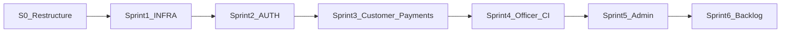

# Implementation Roadmap — Prime Fibernet Enterprise v2.0

Official tickets: [FEATURE_TICKETS.md](FEATURE_TICKETS.md) (42 tickets, 229 SP, 6 sprints).

## Milestone overview



---

## S0 — Restructure (complete when unified app runs)

| Deliverable | Status |
|-------------|--------|
| `apps/unified-app` with Redux + React Navigation | In progress |
| Role shells: Customer tabs, Officer drawer, Admin drawer | In progress |
| Archive `apps/customer`, `apps/officer` | In progress |
| Theme tokens from frontend spec §1.1 | In progress |
| Root `pnpm dev` script | In progress |

---

## Sprint 1 — INFRA (INFRA-004, INFRA-005, INFRA-006)

| Ticket | Deliverable |
|--------|-------------|
| INFRA-004 | RLS policies on all core tables |
| INFRA-005 | `supabase/migrations/`, seed data |
| INFRA-006 | `user_fcm_tokens`, expo-notifications handlers |

**Definition of done:** Migrations apply cleanly; RLS test matrix documented; FCM token stored on login.

---

## Sprint 2 — AUTH (AUTH-001 → AUTH-007)

| Ticket | Deliverable |
|--------|-------------|
| AUTH-001 | Sign-up + email verification |
| AUTH-002 | Login + SecureStore + authSlice |
| AUTH-003 | Admin TOTP (Edge Function) |
| AUTH-004 | RTK Query refresh mutex |
| AUTH-005 | Forgot password |
| AUTH-006 | Biometric (P2 backlog) |
| AUTH-007 | Role-based AppNavigator |

---

## Sprint 3 — Customer + Payments

CUST-001, CUST-002, PYMT-001, PYMT-002, PYMT-003

---

## Sprint 4 — Officer + CI

OFF-001 → OFF-004, INFRA-001 (EAS), INFRA-002 (Sentry)

---

## Sprint 5 — Admin

ADM-001 → ADM-005

---

## Sprint 6 — Backlog

CUST-006, ADM-006–009, OFF-005–007, PYMT-004–005, INFRA-003

---

## Repository layout (target)

```
apps/unified-app/     Single Expo app
packages/types/       Shared Zod schemas
packages/ui/          Design system
packages/api-client/  Supabase client factory
packages/config/      ESLint + TSConfig
supabase/             migrations, functions, seed
docs/source/          Official PDF/DOCX/MD originals
```

---

## First vertical slice (after S0)

1. Run unified app → login screen  
2. Supabase sign-in → role-based home  
3. Customer dashboard placeholder with RTK Query hook  
